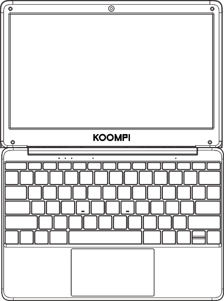
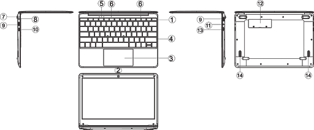
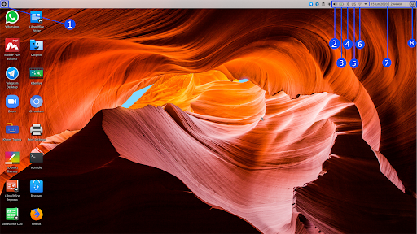
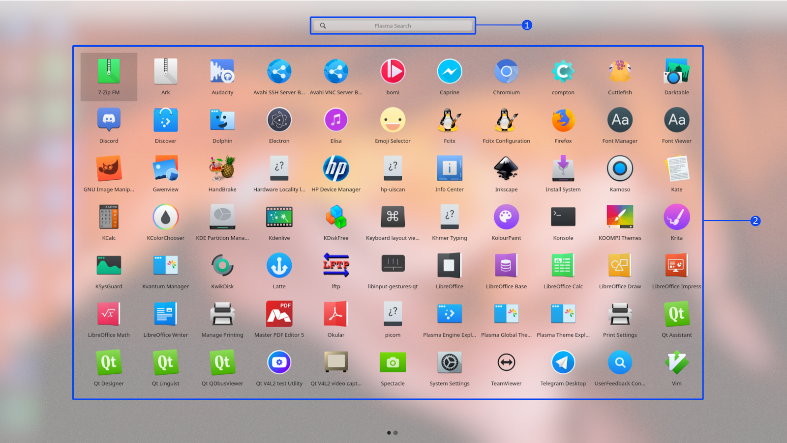
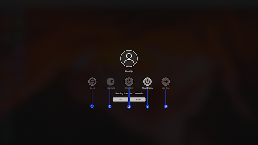

### USER MANUAL GUIDE KOOMPI E11
Welcome to KOOMPI! We’re thrilled you’ve chosen us. 

This guide will help you get the most out of your new PC. 

Read through this quick start guide carefully to ensure the safe and proper use of your PC.

### Safety Precaution

1. DO NOT place on uneven or unstable work surfaces. Seek servicing if the casing has been damaged.
1. DO NOT place or drop objects on top of the PC. 
1. DO NOT expose to dirty or dusty environments. DO NOT operate during a gas leak.
1. DO NOT expose strong magnetic or electrical fields.
1. DO NOT press or touch the display panel or place together with small items that may scratch or enter the PC.
1. DO NOT expose to or use near liquids, rain, or even the electrical storms.
1. DO NOT leave the PC on your lap or any part of the body to prevent discomfort or any injury from heat exposure.
1. Battery safety warning: DO NOT throw the battery in fire or disassemble the battery.
1. SAFE TEMP: This PC should only be used in environments with ambient temperatures between 5°C and 35°C.
1. DO NOT carry or cover a PC that is powered ON.
1. DO NOT Throw the PC in municipal waste. This product has been designed to enable proper recycling. 

**The symbol of the crossed-out wheeled bin indicates that the product(electrical equipment ) should not be placed in municipal waste.**      

### Unit at a Glance

1. Power button        : Press it down to start or close the screen panel. You can also let the 
  computer enter dormancy through this button or wake from the dormancy mode.
2. Front camera        : take pictures or shoot videos.
3. Touchpad            : The device can be operated directly.
4. Keyboard board        : The device can be operated directly.
5. Indicators            : 1 work light, bright white when the machine starts to work;
                        2 is the white light when the Caps Lock indicator Caps Lock; 
                        3 is the white light when the Touchpad Lock indicator Touchpad Lock.
6. Microphone        : can transmit audio signals to a device at work. 
7. Charge indicator        : red light when plug adapter 
8. DC charging base        : use the built-12V / 2A charger.
9. USB 3.0 Interface        : You can insert U disk, mouse, and keyboard directly.
10. MINI HDMI Interface    : high-definition multimedia interface.
11. Headphone jack        : This jack device can transmit audio signals to the speakers or headphones.
12. SSD cover
13. Micro SD card slot    : built-in memory card reader slot that supports Micro SD format.
14. Speakers            : the built-in speaker works without additional connected devices.

### Interface Introduction

1. Applications Menu    : Opens the Applications List.
2. Speaker            : Shows the current volume speaker.
3. Battery            : Shows the battery percentage.
4. Bluetooth            : Enable ON or OFF.
5. Keyboard Language    : Switches between languages.
6. Wifi:             : Connect or Disconnect. 
7. Date & Time        : Shows current date and time.
8. Power Options        : Sleep, Poweroff, Reboot, or Log Out

### Applications Menu

- Searching Bar     : A tool for search APPLICATIONS by the NAME.
- Applications List     : A list that contains all the Apps that have been installed.

### Applications

1. Figma: Interface Designing Tool.
2. PDF Viewer: Worksheet viewer for any documents.
3. OBS: Highly functional streaming and recording program.
4. Google Chrome: Web browser.
5. Darktable: A virtual lighttable and darkroom for photographers.
6. Krita: Graphic editor for designing digital painting and 2D animation.
7. Kdenlive: Open-source video editor with many tools.
8. Inkscape: Graphic editor used for creating images, editing photos, and more.
9. Qt: Open-source platform for creating graphical user interfaces.  
10. Gwenview: Image and photo viewer

### Power Options

1. Sleep: Cut power to unneeded systems while RAM still has enough power to run. 
1. Hibernation: Powers down the computer while retaining its state, which saves all contents access memory to                                        HARD DISK.
1. Reboot: To restart the PC system.
1. Poweroff: To turn OFF the PC.
1. Log Out: For switching the current USER to other USERS.

### Specifications

| Processor  | INTEL APL3350|
| ----------- | ----------- |
| RAM | 4 GB |
| ROM | 128 GB | 
|Display | 11.6” 1920*1080 IPS|
|Wi-Fi Networking | IEEE 802.11 b/g/n|
|Audio Output |3.5mm headphone|
|USB Host |2xUSB3.0|
|HDMI |MINI HDMI x1|
|Bluetooth |4.0|
|Camera|0.3MP|
|Operating System| KOOMPI OS|
|Power|Rechargeable Li-poly battery Power Adapter (DC IN 12V,2A)|
|Speakers | 2x0.8W speakers|

### Get Support
Please visit koompi.com to keep up with our latest products and news. Join the growing KOOMPI Community by:
- Telegram:         https://t.me/koompi
- E-mail:         pi@koompi.com 
- Website:         koompi.com 
- Open-source code:     github.com/koompi

