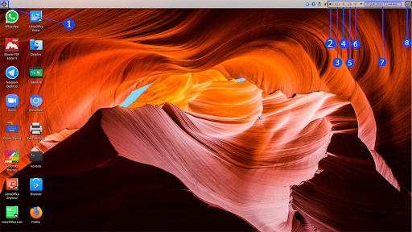
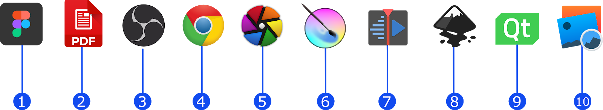

### សៀវភៅណែនាំអំពី KOOMPI E11
សូមស្វាគមន៍មកកាន់គម្ពីរ!យើងមានការរំភើបខ្លាំងណាស់ដែលអ្នកបានជ្រើសរើស KOOMPI ។ 

ការណែនាំខាងក្រោមនេះ នឹងជួយអ្នកឱ្យទទួលបាន អត្ថប្រយោជន៍ច្រើនបំផុតពីកុំព្យូទ័ររបស់អ្នក។ 

សូមអានសៀវភៅណែនាំនេះដោយយកចិត្តទុកដាក់ដើម្បីធានាសុវត្ថិភាពនៃការប្រើប្រាស់កុំព្យូទ័ររបស់អ្នក។

### សុវត្ថិភាពក្នុងការប្រើប្រាស់

១. កុំដាក់នៅលើផ្ទៃមិនរាបស្មើឬមិនមានលំនឹង។ ស្វែងរកសេវាកម្មជួសជុលពីក្រុមការងារគម្ពីរបើមានការខូចខាត។

២. កុំដាក់ឬទម្លាក់វត្ថុរឹងនៅលើកុំព្យូទ័រ។

៣.កុំប្រើប្រាស់នៅក្នុងបរិស្ថានកខ្វក់ឬមានធូលី និង កំឡុងពេលលេចធ្លាយឧស្ម័ន។

៤. កុំប្រើប្រាស់នៅក្បែរដែនម៉ាញេទិច ឬប្រភពអគ្គីសនីខ្លាំង។

៥. កុំចុចឬប៉ះអេក្រង់ជាមួយរបស់តូចៗដែលអាចធ្វើឲ្យឆ្កូតឬចូលកុំព្យូទ័រ។

៦. កុំប្រើប្រាស់នៅក្បែរវត្ថុរាវឫពេលមានភ្លៀងព្យុះ។

៧. កុំដាក់កុំព្យូទ័រនៅលើភ្លៅរបស់អ្នកឬផ្នែកណាមួយនៃរាងកាយដើម្បីការពារសុខភាពរបស់អ្នក។

៨. សូមប្រើប្រាស់ថ្មដោយសុវត្ថិភាព៖ ចូរកុំចោលថ្មកុំព្យូទ័រជាមួយសម្រាមផ្សេងៗក្នុងគេហដ្ខានឬដោះថ្មចេញដោយខ្លួនឯង។

៩. សូមប្រើប្រាស់តែនៅក្នុងបរិស្ថានដែលមានសីតុណ្ហភាពព័ទ្ធជុំវិញចន្លោះពី ៥ អង្សាសេទៅ ៣៥ អង្សាសេប៉ុណ្ណោះ។

១០.កុំយកវត្ថុផ្សេងៗមកស្រោបពីលើកុំព្យូទ័រនៅពេលវាដំណើរការ។

១១. កុំបោះកុំព្យូទ័រចោលក្នុងធុងសំរាមទូទៅ។ ផលិតផលនេះត្រូវបានធ្វើឡើងដើម្បីអាចកែឆ្នៃឡើងវិញបាន។ 

**សម្គាល់៖ និមិត្តសញ្ញានៃធុងសំរាមដែលមានសញ្ញាខ្វែងបង្ហាញថាផលិតផល (ឧបករណ៍អគ្គីសនី) មិនគួរដាក់ក្នុងកាកសំណល់ទូទៅឡើយ។**

### ផ្នែកផ្សេងៗនៃកុំព្យូទ័រ

១. Power button        : ចុចដើម្បីបើករឺបិទអេក្រង់។ អ្នកក៏អាចទុកឲ្យកុំព្យូទ័រផ្អាកដំណើរការជាបណ្តោះអាសន្នឬដំណើរការវិញ។

២. Front camera        : ថតរូបភាពឬវីដេអូ

៣. Touchpad            : សម្រាប់ដំណើរការដោយការប្រើប្រាស់ផ្ទាល់

៤. Keyboard            : សម្រាប់ដំណើរការដោយការប្រើប្រាស់ផ្ទាល់

៥. Indicators            : ភ្លើង work light ភ្លឺនៅពេលម៉ាស៊ីនចាប់ផ្តើមដំណើរការ
   ភ្លើងស ភ្លឺនៅពេលបើក Caps Lock 
   ភ្លើងស សំគាល់ Touchpad Lock 

៦. Microphone        : បញ្ចេញសម្លេងនៅពេលប្រើប្រាស់មា៉ស៊ីន 

៧. Charge indicator        : ភ្លើងក្រហមនៅពេលដោតសាកកុំព្យូទ័រ  

៨. DC charging base        : ប្រើប្រាស់ -12V / 2A charger

៩. USB 3.0 Interface        : អាចដោត U disk mouse និង keyboard ដោយផ្ទាល់

១០. MINI HDMI Interface    : multimedia interface កម្រិតខ្ពស់

១១. Headphone jack        : បញ្ចេញសម្លេងតាមរយៈspeaker រឺកាសត្រចៀក

១២. SSD cover

១៣. Micro SD card slot    : built-in memory card reader slot ប្រើប្រាស់ជាមួយ Micro SD format

១៤. Speakers            : built-in speaker ប្រើប្រាស់ជាមួយdeviceដទៃទៀត

### ការណែនាំអំពី Interface

១. Applications Menu    : បើកមីនុយកម្មវិធី

២. Speaker            : បង្ហាញកម្រិតសម្លេង

៣. Battery            : បង្ហាញកម្រិតថ្ម

៤. Bluetooth            : បើកដំណើរការឬបិទប៊្លូធូ

៥. Keyboard     : ផ្លាស់ប្តូរភាសា

៦  Wifi:         : ភ្ជាប់ឬផ្តាច់ពីអុិនធឺនិត

៧. Date & Time    : បង្ហាញកាលបរិច្ខេទនិងពេលវេលាបច្ចុប្បន្ន

៨. Power Options    : Sleep, Poweroff, Reboot, ឫ Log Out

### មីនុយកម្មវិធីប្រើប្រាស់

- Search Bar        : ស្វែងរកកម្មវិធីតាមរយៈការវាយបញ្ចូលឈ្មោះរបស់កម្មវិធី 
- Applications List     : តារាងរាយឈ្មោះកម្មវិធីទាំងអស់ដែលបានបញ្ចូលក្នុងកុំព្យូទ័រ

### កម្មវិធីប្រើប្រាស់

១. Figma        : កម្មវិធីសម្រាប់រចនា Interface

២. PDF Viewer    : កម្មវិធីសម្រាប់បើកមើលឯកសារ

៣. OBS        : កម្មវិធី ថតនិង streaming 

៤. Google Chrome    : សម្រាប់ការឆែកអុិនធឺនិត

៥. Darktable        : កម្មវិធីសម្រាប់កាត់តរូបភាព

៦. Krita        : កម្មវិធីរចនារូបភាពឌីជីថលនិងវីដេអូ 2D 

៧. Kdenlive        : កម្មវិធី សម្រាប់កាត់តវីដេអូ

៨. Inkscape        : កម្មវិធីសម្រាប់កាត់តរូបភាពនិង រូបថត

៩. Qt            : កម្មវិធីសម្រាប់បង្កើត graphical user interfaces

១០. Gwenview    : កម្មវិធីបើកមើលរូបភាពនិងរូបថត 

### ការប្រើប្រាស់ថាមពល

១. Sleep        : កាត់បន្ថយការប្រើប្រាស់ថាមពលសម្រាប់កម្មវិធីដែលមិនចាំបាច់ដើម្បីទុកថាមពលសម្រាប់RAM

២. Hibernation    : កាត់បន្តយការប្រើប្រាស់ថាមពលដោយរក្សាស្ថានភាពកុំព្យូទ័រហើយរក្សាទុកនូវព័ត៌មាននៅលើ hard disk

៣. Reboot    : បើកដំណើរការកុំព្យូទ័រឡើងវិញ

៤. Poweroff    : បិទកុំព្យូទ័រ

៥. Log Out    : ផ្លាស់ប្តូរអ្នកប្រើប្រាស់

### Specifications

| Processor  | INTEL APL3350|
| ----------- | ----------- |
| RAM | 4 GB |
| ROM | 128 GB | 
|Display | 11.6” 1920*1080 IPS|
|Wi-Fi Networking | IEEE 802.11 b/g/n|
|Audio Output |3.5mm headphone|
|USB Host |2xUSB3.0|
|HDMI |MINI HDMI x1|
|Bluetooth |4.0|
|Camera|0.3MP|
|Operating System| KOOMPI OS|
|Power|Rechargeable Li-poly battery Power Adapter (DC IN 12V,2A)|
|Speakers | 2x0.8W speakers|

### Get Support
សូមចូលទៅគេហទំព័រ koompi.com ដើម្បីតាមដានពីផលិតផលនិងព័ត៌មានថ្មីៗរបស់យើង។ ចូលរួមជាមួយគម្ពីរតាមរយៈ ៖
- Telegram:         https://t.me/koompi
- E-mail:         pi@koompi.com 
- Website:         koompi.com 
- Open-source code:     github.com/koompi

