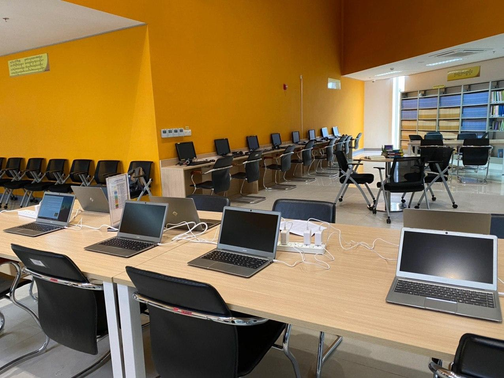
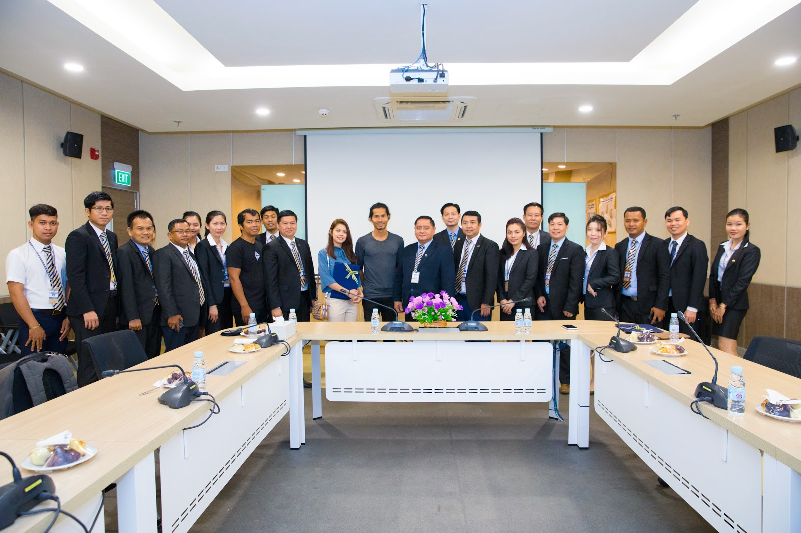

# ACLEDA Institute of Business (AIB) welcomes open-source technology

*05th March 2020*

The AIB campus sits on 7.57ha and consists of six buildings comprising of a canteen, a bookstore, a library, a football field, volleyball and basketball courts and other facilities. The institute is capable of accommodating 627 employees and 2,866 students per academic term.

27th December 2018, [Phnom Penh Post](https://www.phnompenhpost.com/business/acleda-inaugurates-new-business-school-campuses-pps-sen-sok)

**Mr. Thul Rithy** and AIB managing director **Phon Narin** signed an official memorandum of understanding Thursday for the provision of 15 KOOMPI laptops to be stationed in the institution’s computer laboratory for one year.

It is with great honor for KOOMPI to partner with one of the leading business institutions in Cambodia whose mission is to provide learners with the superior quality of higher education service and professional training in business education to build their knowledge, professional skills, experiences, ethics, and networking.

We hope that this partnership will enable a more utilized study space for the students and teachers of AIB. By introducing open-source technology to the banking and fintech sector, students can learn even more about collaborative software technology. In an evolving digital scene, this is one of the best methods that can accelerate innovation in financial services.

Join our telegram channels to hear exciting announcements and get in touch with our team!
KOOMPI Announcements: https://t.me/koompinews
KOOMPI Community: https://t.me/koompi
Tags:
- [Acleda](https://medium.com/tag/acleda)
- [Institute Of Business](https://medium.com/tag/institute-of-business)
- [Koompi](https://medium.com/tag/koompi)
- [Linux Os](https://medium.com/tag/linux-os)
