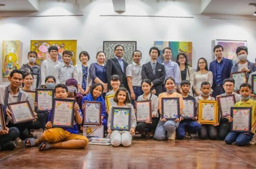
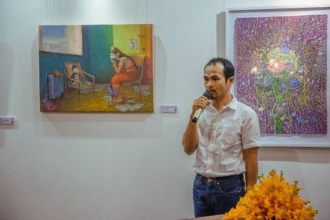
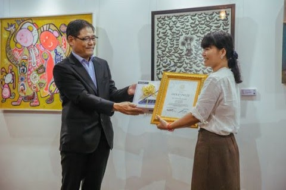
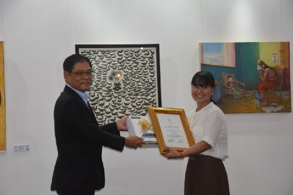
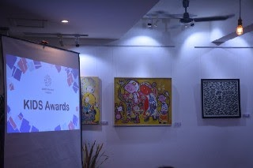
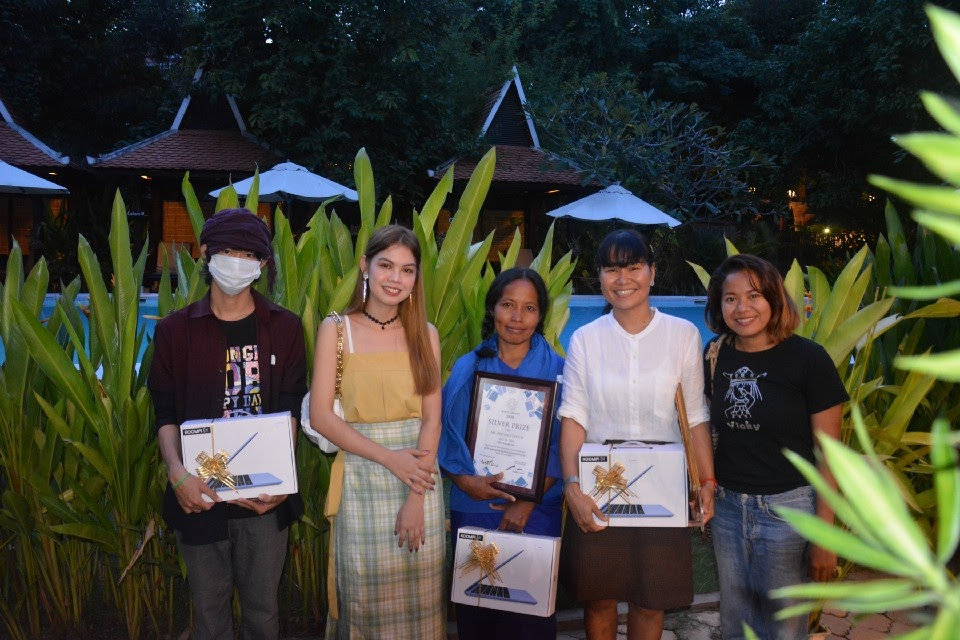

# Announcing the Winners of White Canvas Cambodia 2020

*24th October 2020* 

[White Canvas Cambodia 2020](https://www.facebook.com/White-Canvas-Visual-Arts-Showcase-Cambodia-101208878254978), organized by [Social Compass Cambodia](https://www.facebook.com/socicomp), has finally announced the winners at the art gallery of **iRoHa Garden Hotel** on 24th October. 

There are two categories of winners, **children** and **adults** with prizes ranging from Gold to Silver and Bronze. Other prizes are **Asian Prize, Social Compass Prize, Eastern Culture Foundation Prize, Embassy Prize, Hope Prize, and Next Generation Prize.** 

The judge panel consisted of **Mr. Poy Chhunly** from [Phare Ponleu Selpak](https://www.facebook.com/phareponleuselpak/) (Battambang) and **Mr. Seng Visal**, arts professor from [Yamada School of Art.](https://www.facebook.com/yamadaschoolofart)

Below are the announced winners: 

**Adult:** 
- Gold Prize: **Ms. Koeurm Kolab (Artwork titled 2020 or CoVid-19)**
- Silver Prize: **Ms. Khchao Touc**h
- Bronze Prize: **Mr. Chhim Hai**

**Kids:** 
- Gold Prize: **Loza**
- Silver Prize: **Chhen Rattana (ឈិន រតនា)**
- Bronze Prize: **Phork Sokunveary (ភោគ សុគន្ធវារី)**

KOOMPI is honored to see [KOOMPI E11](https://koompi.com/koompi/e11/) notebooks awarded to the three winners.
Want to know about the meaning behind the winning artwork? Read more [here](https://m.postkhmer.com/%E1%9E%87%E1%9E%B8%E1%9E%9C%E1%9E%B7%E1%9E%8F%E1%9E%80%E1%9E%98%E1%9F%92%E1%9E%9F%E1%9E%B6%E1%9E%93%E1%9F%92%E1%9E%8F/%E1%9E%80%E1%9E%B6%E1%9E%9A%E1%9E%94%E1%9F%92%E1%9E%9A%E1%9E%80%E1%9E%BD%E1%9E%8F%E1%9E%94%E1%9F%92%E1%9E%9A%E1%9E%87%E1%9F%82%E1%9E%84%E1%9E%82%E1%9F%86%E1%9E%93%E1%9E%BC%E1%9E%9A-white-canvas-cambodia-%E1%9E%94%E1%9E%B6%E1%9E%93%E1%9E%9A%E1%9E%80%E1%9E%83%E1%9E%BE%E1%9E%89%E1%9E%87%E1%9E%99%E1%9E%9B%E1%9E%B6%E1%9E%97%E1%9E%B8?fbclid=IwAR39Drit8nAGGNNZXxA66_650Kh1QUk1Lt4u4c5N9gCHBviJ35dV03uNPGc) or watch the [video!](https://www.facebook.com/permalink.php?story_fbid=178003210575544&id=101208878254978)

**Get in touch with KOOMPI!**
- E-mail: pi@koompi.com/[TELEGRAM Community and Tech Support/LinkedIn](http://t.me/koompinews)
- Phone Number: (+855)77990887

**Get in the loop:**
- [KOOMPI Website/Facebook page/Medium blog/Telegram announcements](http://t.me/koompinews)

**Source Code & Projects:** 
- Open-source code at [Github](http://github.com/koompi)

**User manual:** 
- koompi.org

