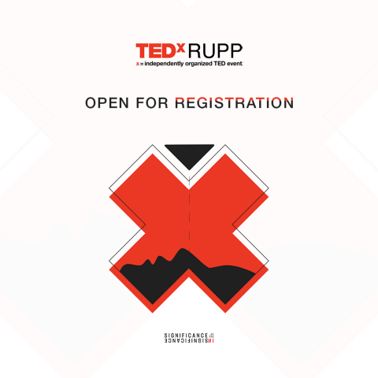

# Back to University … and TEDx
 
*12th November 2020*

**The original TEDx university event is back!**

Get ready for another TEDxRUPP on **Sunday 29th this month!** The event will take place in Phnom Penh from **1 pm to 5 pm** around the theme “**Significance of the Insignificance**”, *meaning everyday habits or activities, no matter how big or small, have a major impact towards self-development and society,* as expressed by President Meily TE. 

**Check out the poster below for speakers and their chosen topics!**

- Belle Sodhachivy Chumvan — Evolution of Khmer Dances and Female Dancers
- Bou Chum Sambath Both — The Significance of Good Logos
- Cham Bunthet — Beliefs that Lower Women and Weaken the Society
-  Euan Gray — Exploring Identity in Cambodian Songs
- Hok Sovanvotey — Menstruation is Life! Embrace It!
-  Keo Sothie — Rethinking Crime and Punishment
- Scott Neeson — A Single Seed
- Tham Sokhak — Is It Bad to be an Opportunist?
- Yim Sotheary — Women and Her Shadow: Rethinking Parenting

### Event recap: 
Date: Sunday 29th November 2020, 

Theme: Significance of the Insignificance

**Admission fee:**

$7 for students, 

$10 for general public

Registration [link](http://bit.ly/JoinTEDxRUPP2020)

Number: +855 15 563 567

There are three main areas of topics TEDxRUPP focuses on this year, which are:
- Education: more than just what is taught, but also how things can be learned
- Art: the significance of visual display in film, design, photo, architecture or more
- Tech: the possibility that technology can uplift individuals and social well-being.

Independently produced and operated under an official license from TED by a group of dedicated youth volunteers from various universities, TEDxRUPP is aimed at building community and creating dialogue as well as giving people a platform to share their great ideas passions, and experiences.

The event is proudly sponsored by Smart Axiata, True Money, IZE Cola, Foodpanda, Manulife, Nano Sounds, BREW by R.T.K Coffee & Restaurant, Tino the Coffee Yard, and CO-Creative Corner.

This event is also supported by Sabay, Ahladang, Bizkhmer, Focus Cambodia, OMOHub, the Desk, Factory Phnom Penh and KOOMPI.

For more information about the event, speakers, and core team, visit : [TEDxRUPP’s website](http://tedxrupp.com), [Facebook page](http://facebook.com/TEDxRUPP/), or [Instagram](http://instagram.com/tedxrupp/).

 

### **About TEDx, x = independently organized event**
In the spirit of ideas worth spreading, TEDx is a program of local, self-organized events that bring people together to share a TED-like experience. At a TEDx event, TED Talks video and live speakers combine to spark deep discussion and connection. These local, self-organized events are branded TEDx, where x = independently organized TED event. The TED Conference provides general guidance for the TEDx program, but individual TEDx events are self-organized. (Subject to certain rules and regulations.)

### **About TED**
TED is a nonprofit organization devoted to Ideas Worth Spreading, usually in the form of short, powerful talks (18 minutes or fewer) delivered by today’s leading thinkers and doers. Many of these talks are given at TED’s annual conference in Vancouver, British Columbia, and made available, free, on TED.com. TED speakers have included Bill Gates, Jane Goodall, Elizabeth Gilbert, Sir Richard Branson, Nandan Nilekani, Philippe Starck, Ngozi Okonjo-Iweala, Sal Khan and Daniel Kahneman.

TED’s open and free initiatives for spreading ideas include TED.com, where new TED Talk videos are posted daily; the TED Translators Program, which provides subtitles and interactive transcripts as well as translations from thousands of volunteers worldwide; the educational initiative TED-Ed; the annual million-dollar TED Prize, which funds exceptional individuals with a “wish,” or idea, to create change in the world; TEDx, which provides licenses to thousands of individuals and groups who host local, self-organized TED-style events around the world; and the TED Fellows program, which selects innovators from around the globe to amplify the impact of their remarkable projects and activities.

Follow TED on [Twitter](http://twitter.com/TEDTalks), [Facebook](http://www.facebook.com/TED), and [Instagram](https://instagram.com/ted).