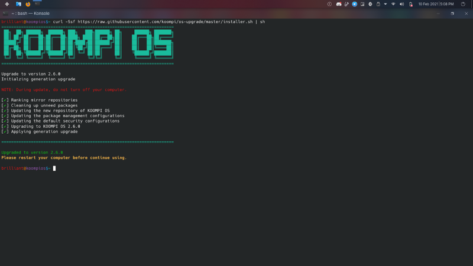

# KOOMPI Releases New ISO (version 2.6)

## Overview
KOOMPI Operating System 2.6 is the latest update in the 2.0 version that can be installed online through a script by our OS team.

## What’s new?
- New features and icons on each theme
- Automatic Wi-Fi connection and auto-lock prevention
- New smart installation to prevent stale from db.lock
- Auto refresh if mirror fails
- Automatically clean and remove orphan dependencies
- Improved conflict prevention
- Prolonged password timeout to 60 minutes
- Shutdown prevention during the update
- Updated user template
- Updated to version 10 of pi command
## Instructions
There are two methods to get the update:
1. ISO Update (Clean & Highly Recommended)
You can download the ISO from the link below, flash it to your USB (8BG minimum), boot into the live USB and run the system installation.
Download: https://dev.koompi.org/iso/koompi_os-2021.02.25-x86_64.iso

2. Online Update (Easy & Quick)
This is the easiest way to update. Just connect to a reliable internet connection, charge your device, and run the command below in your terminal.
curl -Ssf https://raw.githubusercontent.com/koompi/os-upgrade/master/installer.sh | sh

These lines appear after the update is complete.

*Note: This update takes less than 30 minutes with a fast internet connection.*